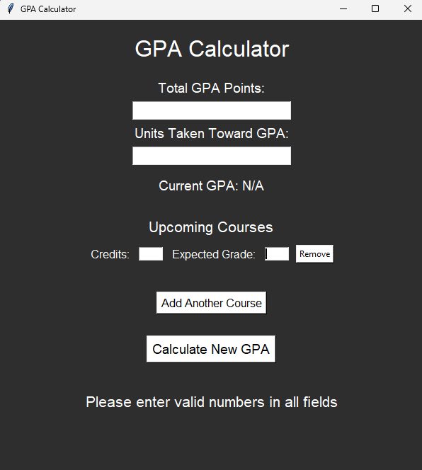

# GPA Calculator

A modern, intuitive GPA calculator built with Python and Tkinter. This tool allows students to compute both their current and projected GPA using a variety of grading inputs including GPA points, letter grades, and percentage scores.

---

## Features

- Clean dark-themed **Tkinter GUI**
- Supports **letter grades**, **4.0 scale GPA values**, and **percentages (0–100%)**
- Dynamically add/remove upcoming courses
- Converts percentage → letter → GPA point automatically
- Displays **current GPA** based on total points and credits
- Computes and displays **projected GPA** based on future course plans
- Gracefully handles user input errors

---

## Screenshot



---

## Getting Started

### 1. Clone the repository

```bash
git clone https://github.com/brandall03/gpa.git
cd gpa-calculator
